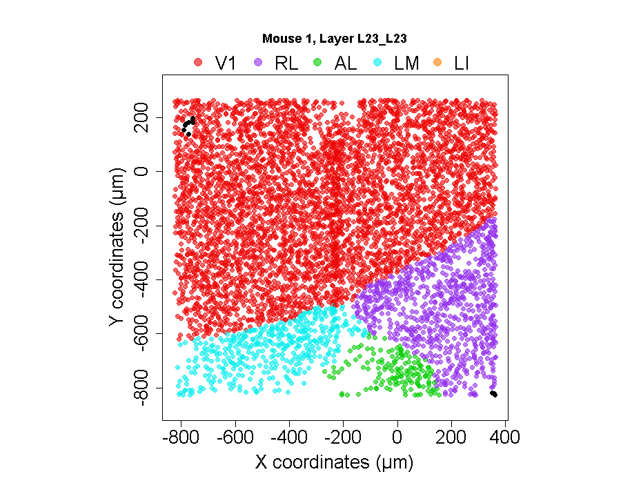
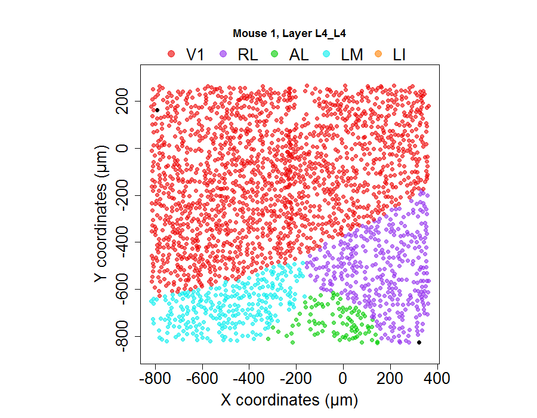
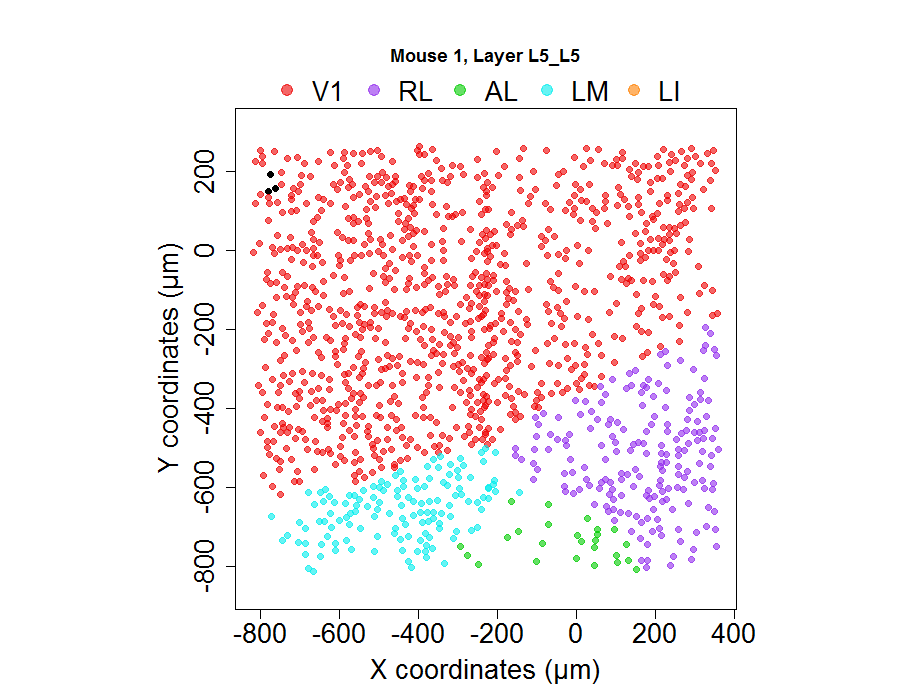
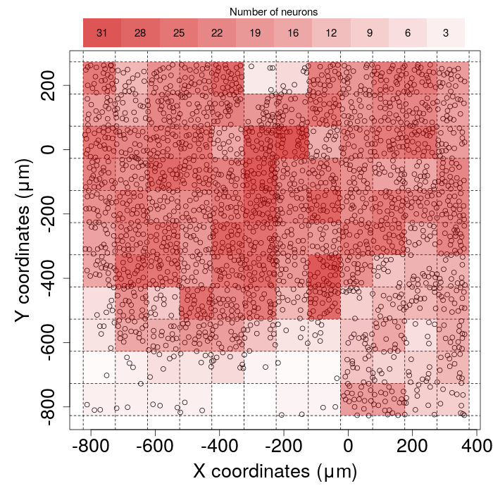
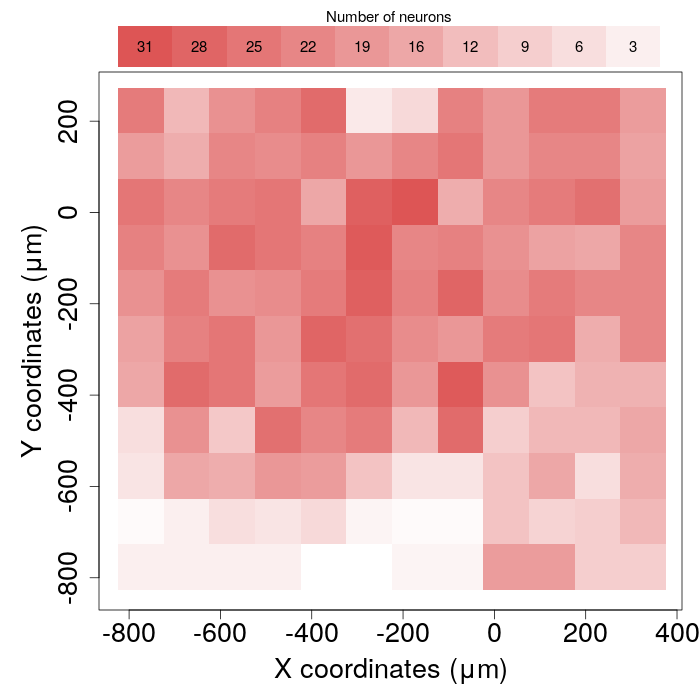
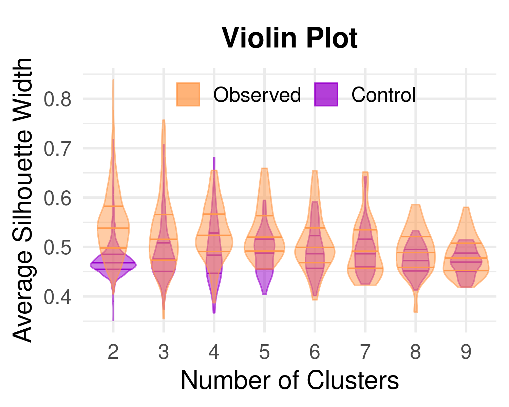

# 2D scatterplot {.tabset .tabset-fade .tabset-pills}

## Layer 2/3 {-}

## Layer 4 {-}

## Layer 5 {-}

# 2D Density Plots {.tabset .tabset-fade .tabset-pills}

## With dots {-}

## Without dots {-}

# Violin Plot

